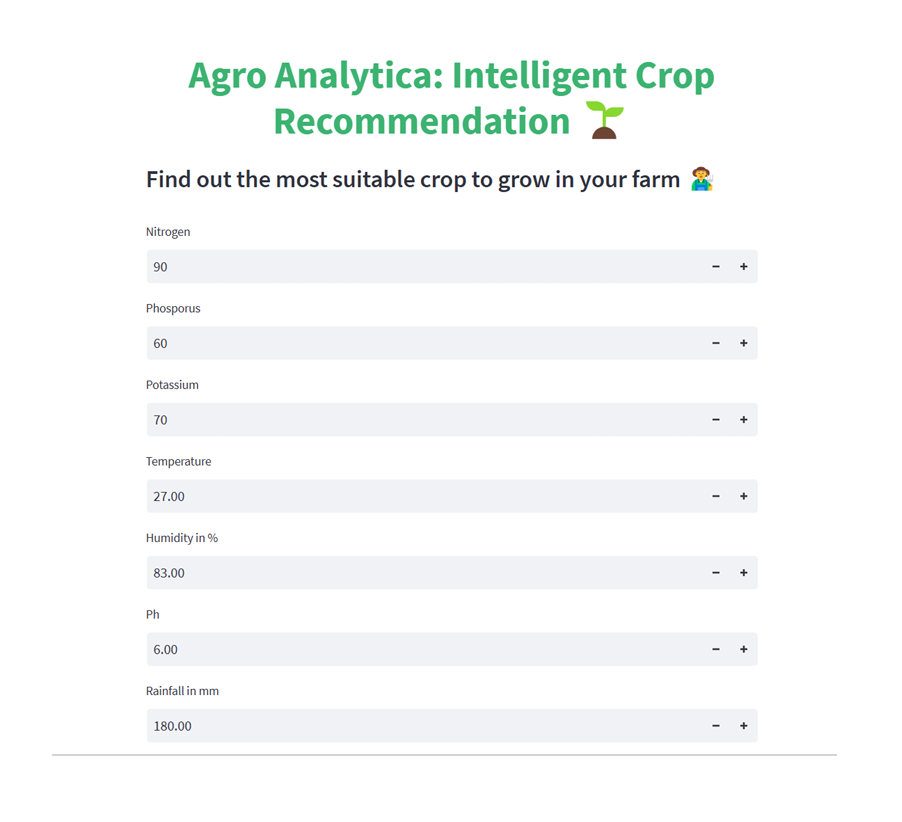

# 🌱 Agro Analytica: Intelligent Crop Recommendation System



A machine learning-based web application that helps farmers determine the most suitable crop to grow based on various soil and environmental parameters.

## 📋 Features

- **Smart Crop Recommendations**: Get AI-powered suggestions for the best crops to grow based on soil and environmental conditions
- **Multiple ML Models**: Choose between Decision Tree and Random Forest models for predictions
- **Interactive Interface**: User-friendly web interface built with Streamlit
- **Detailed Explanations**: AI-generated explanations for why specific crops are recommended
- **Comprehensive Parameters**: Takes into account multiple factors:
  - Nitrogen (N)
  - Phosphorus (P)
  - Potassium (K)
  - Temperature
  - Humidity
  - pH level
  - Rainfall

## 🚀 Getting Started

### Prerequisites

- Python 3.x
- pip (Python package installer)

### Installation

1. Clone the repository:
```bash
git clone https://github.com/arslansb/Crop-Recommendation-system.git
cd Crop-Recommendation-system
```

2. Install the required packages:
```bash
pip install -r requirements.txt
```

### Running the Application

1. Start the Streamlit app:
```bash
streamlit run app.py
```

2. Open your web browser and navigate to the URL shown in the terminal (typically http://localhost:8501)

## 💻 Usage

1. Enter the soil and environmental parameters:
   - Nitrogen content
   - Phosphorus content
   - Potassium content
   - Temperature
   - Humidity
   - pH level
   - Rainfall

2. Select your preferred ML model (Decision Tree or Random Forest)

3. Click "Predict" to get crop recommendations

4. View the AI-generated explanation for the recommendation

## 🛠️ Technologies Used

- **Frontend**: Streamlit
- **Backend**: Python
- **Machine Learning**: 
  - Decision Tree
  - Random Forest
- **Data Processing**: Pandas, NumPy
- **AI Integration**: OpenAI API

## 📊 Models

The system uses two different machine learning models:
1. Decision Tree Model (`descision_tree_model.pkl`)
2. Random Forest Model (`random_forest_model.pkl`)

## 📝 License

This project is licensed under the MIT License - see the LICENSE file for details.

## 🤝 Contributing

Contributions, issues, and feature requests are welcome! Feel free to check the issues page.

## 📧 Contact

For any queries or suggestions, please open an issue in the repository.